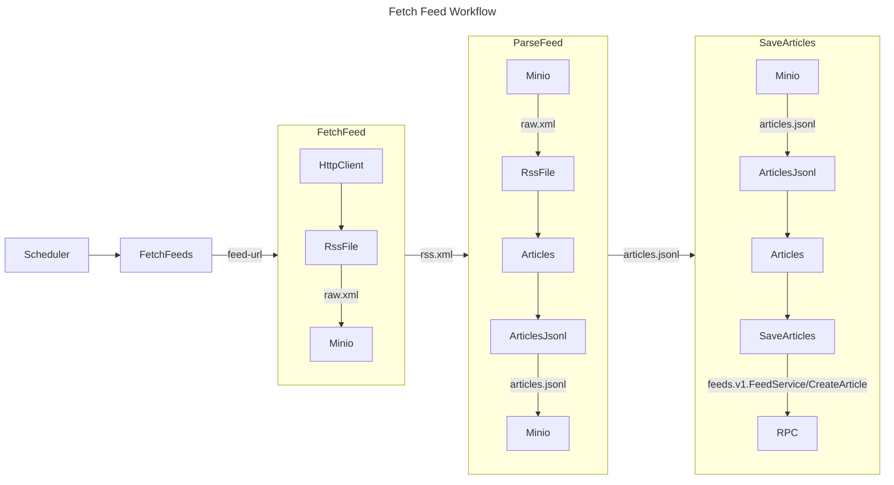

# Feed Pipeline

This is a demonstration pipeline that shows how to ingest RSS feed data into the amalgam project. This type of batch pipeline is easy to write, maintain and scale.

The pipeline is comprised of 3 main steps:

1. Download RSS feed
2. Parse RSS feed into articles
3. Save articles to storage

In classic terminology this could be described as Extract, Transform, Load (ETL).

However, when looking through the pipeline you will see that there is a storage step between each of the main steps. This serves two main points: first, if the pipeline fails, we can easily resume. Second, we can re-run from previous checkpoints at any time. If the pipeline fails at any point, it can be restarted from the last successful step.

When inspecting the code, the pipeline actually has object storage between the main steps. The reason for this is so that the pipeline can be restarted on failure without having to start from the beginning. Another reason is if a bug is discovered in the pipeline, it can be fixed and re-run from the previous checkpoint.

This pipeline utilizes Minio as object storage. This pattern can be easily implemented in GCP with Cloud Storage or AWS with S3.

