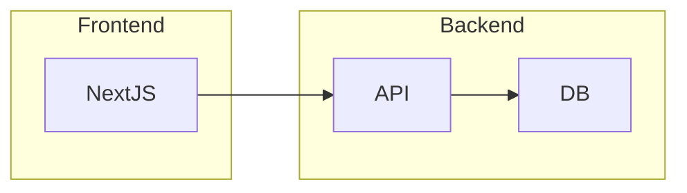
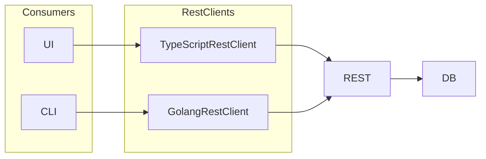
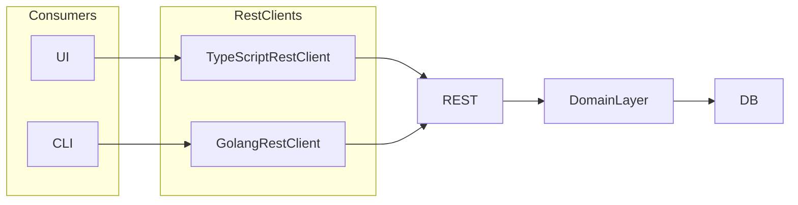
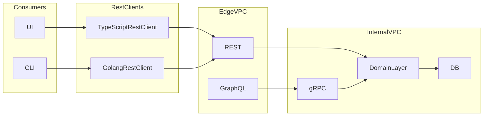
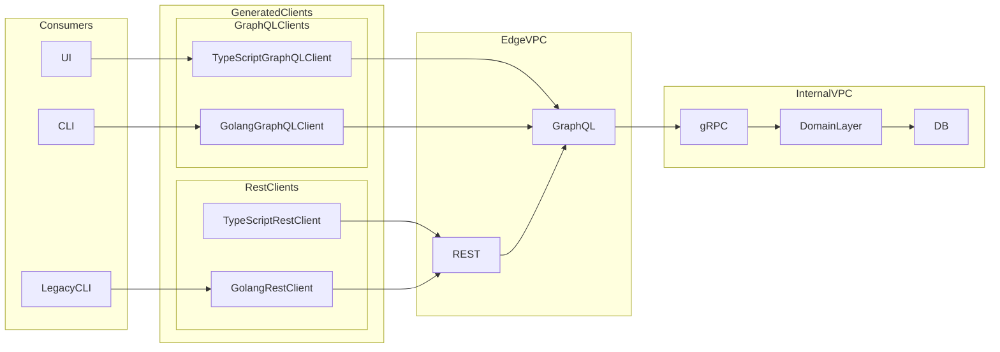
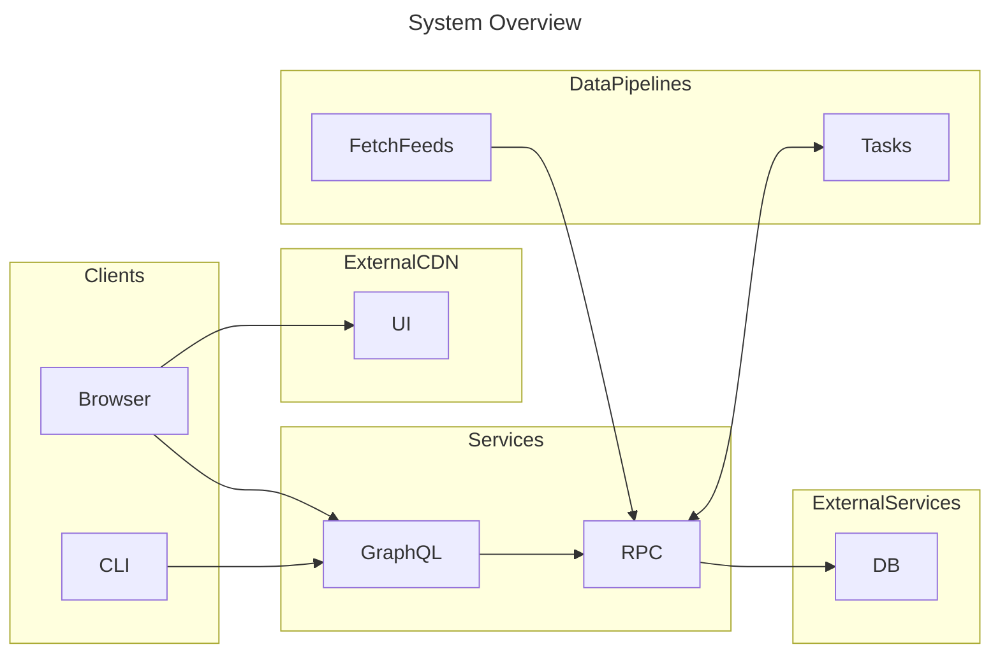
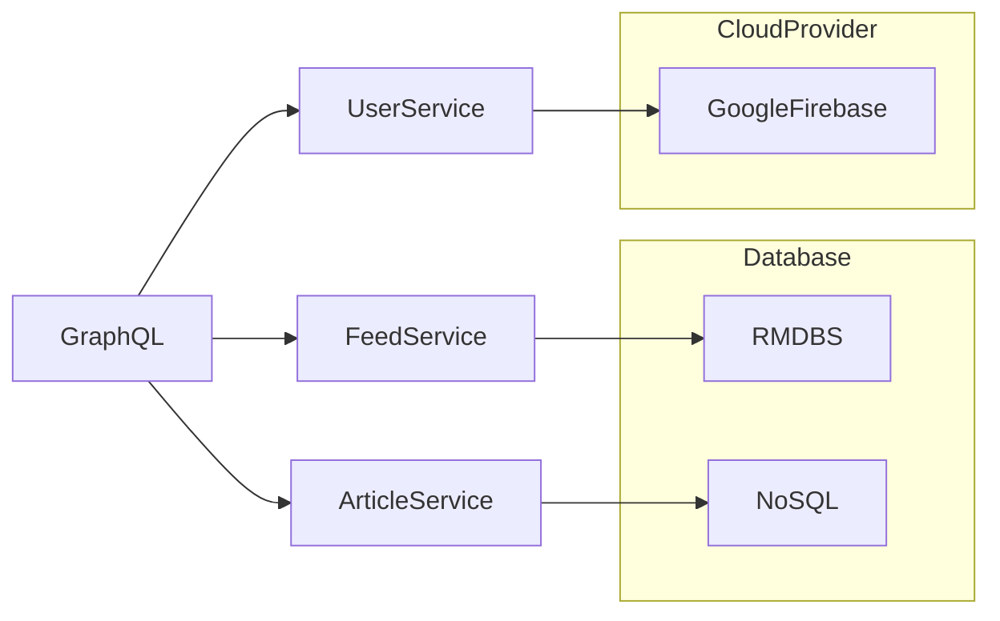

# Architecture Journey

This document outlines how to grow a project from a monolithic REST API to a microservices architecture.

## Beginnings

This is the typical web application starting point. A single codebase that handles all the web traffic, business logic, and data access.

## [v0.1.0](https://github.com/ericbutera/amalgam/releases/tag/v0.1.0) Monolithic REST API

Next up I have added a simple CLI to list feeds. At this point it is important to notice that we have multiple consumers of the API. Writing and maintaining clients by hand is time consuming and error prone. To ease this burden I will also introduce [openapi-generator](https://github.com/OpenAPITools/openapi-generator), which can generate clients in multiple languages. We also get the benefit of strong typing in languages like TypeScript and Go moving some errors from runtime to compile time.

## [v1.0.0](https://github.com/ericbutera/amalgam/releases/tag/v1.0.0) Introduce Domain Layer

The [domain layer](https://en.wikipedia.org/wiki/Domain-driven_design) will ensure that business logic is separate from any single service. This will allow standing up new services much easier.

## [v1.1.1](https://github.com/ericbutera/amalgam/releases/tag/v1.1.1) Add GraphQL and gRPC

This update adds the next iteration of boundaries in our system: [GraphQL](https://graphql.org/) and [gRPC](https://grpc.io/). GraphQL will be our public facing API Gateway while gRPC will be used for internal communication between services.

GraphQL is an excellent choice as it has the ability to generate clients in multiple languages. We also have the benefit of strong typing and the ability to request only the data we need. As the stack evolves, GraphQL will provide a consistent interface to backend services.

GraphQL doesn't require strongly typed clients, but generating them ensures requests and responses are well formed. This also ensures developers are alerted of deprecations or changes in the API at compile time.

## [v1.3.2](https://github.com/ericbutera/amalgam/releases/tag/v1.3.2) Refactor REST to use GraphQL backend

Phase 3: Refactor REST, Introduce GraphQL Clients.

Now we are in an interesting position where we have a legacy REST API. While the internals have been ported to GraphQL, there are still data transforms that occur at each boundary.

Options:

- Continue maintaining OpenAPI spec
- Figure out how to generate OpenAPI spec from GraphQL schema
- Possibly use gRPC gateway to replace REST API

## [v1.4.0](https://github.com/ericbutera/amalgam/releases/tag/v1.4.0) GraphQL Gateway powered by Data Pipelines

As of v1.4.0, the system has stabilized around GraphQL as our API Gateway. It is possible to make sweeping changes to the internal system without having to change our external contract. For instance, we can now delete the API service. We can also split up any internal service to support horizontal scaling.

Note: in prod there would be an ingress controller in front of the GraphQL service. This would handle things like rate limiting, authentication, and other concerns.

### Components

- [UI](https://github.com/ericbutera/amalgam/tree/ad3d79839030889826a8fb2f0c0dcad48bf9d06e/ui)
- Services
  - [GraphQL](https://github.com/ericbutera/amalgam/tree/ad3d79839030889826a8fb2f0c0dcad48bf9d06e/graph)
  - [gRPC](https://github.com/ericbutera/amalgam/tree/ad3d79839030889826a8fb2f0c0dcad48bf9d06e/rpc)
- Data Pipelines
  - Temporal
    - [FetchFeeds](https://github.com/ericbutera/amalgam/tree/ad3d79839030889826a8fb2f0c0dcad48bf9d06e/data-pipeline/temporal/feed)
    - [FeedTasks](https://github.com/ericbutera/amalgam/tree/ad3d79839030889826a8fb2f0c0dcad48bf9d06e/data-pipeline/temporal/feed_tasks)

## Ancillary Services

- K6
  - [load test graph service](https://github.com/ericbutera/amalgam/tree/main/k6/load-test-graph)
  - [traffic generator](https://github.com/ericbutera/amalgam/tree/main/k6/simulate-traffic)
- [Faker](https://github.com/ericbutera/amalgam/tree/main/services/faker) (data generator)
- [Observability](https://github.com/ericbutera/amalgam/tree/main/containers/tilt/extensions/lgtm)
  - [dashboards](https://github.com/ericbutera/amalgam/tree/main/containers/lgtm/grafana/conf/provisioning/dashboards)
  - [alerts](https://github.com/ericbutera/amalgam/tree/main/containers/lgtm/grafana/conf/provisioning/alerting)
- [Minio](https://github.com/ericbutera/amalgam/blob/main/containers/tilt/extensions/minio/Tiltfile)
- [MySQL](https://github.com/ericbutera/amalgam/blob/main/containers/tilt/extensions/mysql/Tiltfile)

In this revision I have added Temporal as the workflow orchestrator. The FetchFeeds workflow is a simple [ETL](https://en.wikipedia.org/wiki/Extract,_transform,_load). It fetches rss, stores, transforms into articles, and loads into the database (via domain layer, not directly).

Feed Tasks are ad-hoc, created from RPC. At time of writing this was used to show how to generate fake data.

Fetch Feeds:

- runs on a continuous schedule
- mimics a simple Extract Transform Load (ETL) pipeline
- uses Object Storage locations as input and output

## Next Steps

Next the goal will be to start splitting the gRPC backend into separate services to allow for horizontal scaling.

By using GraphQL as our gateway, we can radically refactor the backend without having to update any downstream consumers.

