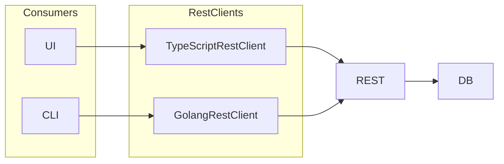
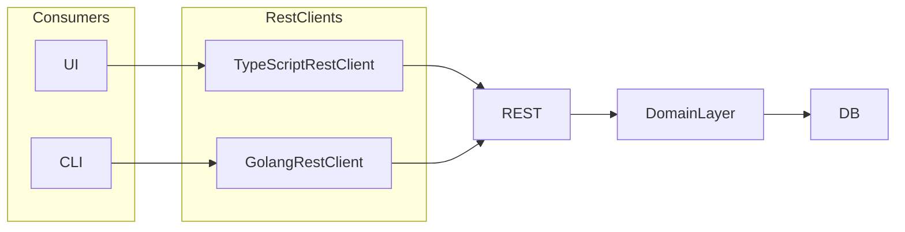
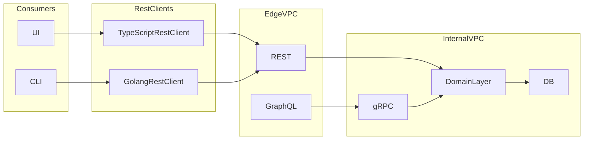
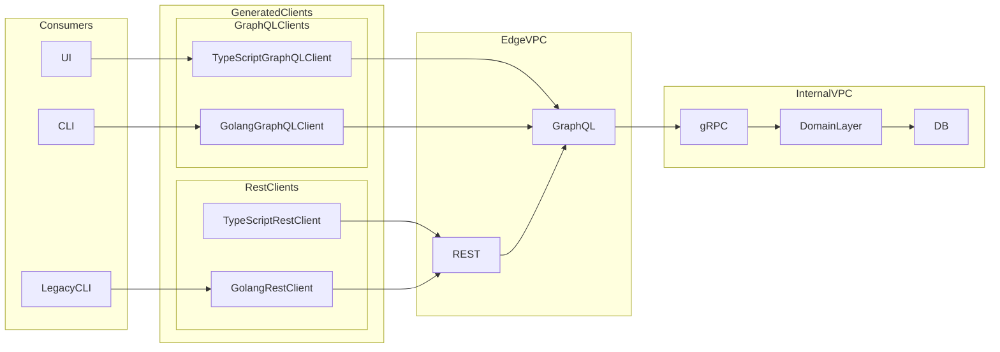
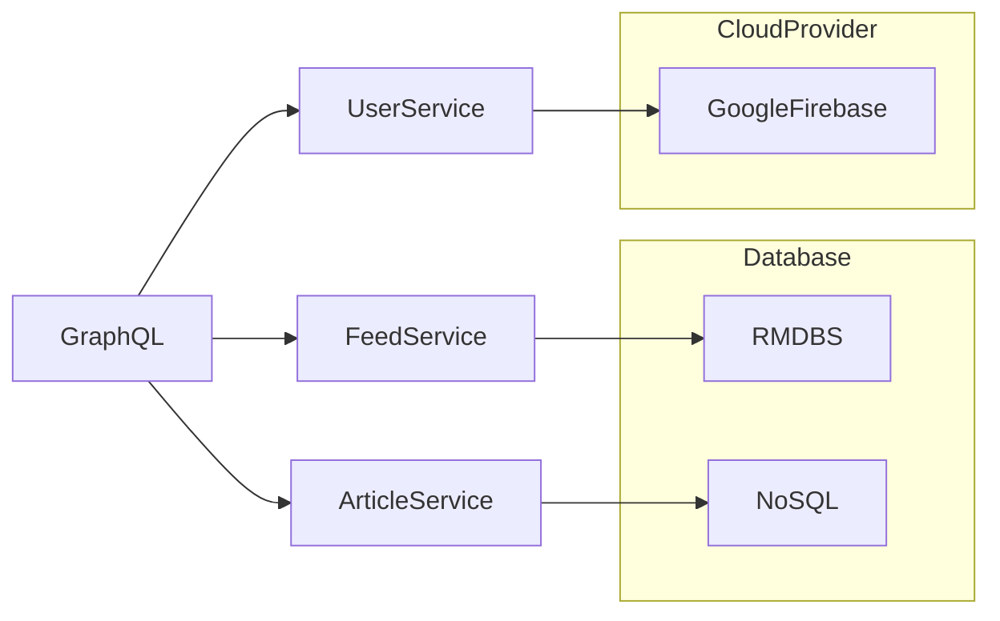

# Architecture Journey

This document outlines how to grow a project from a monolithic REST API to a microservices architecture.

## [v0.1.0](https://github.com/ericbutera/amalgam/releases/tag/v0.1.0) Monolithic REST API

This is the typical web application starting point. A single codebase that handles all the web traffic, business logic, and data access. This is a good starting point for a tech demo.

The REST Clients are [generated](https://github.com/OpenAPITools/openapi-generator) via the OpenAPI spec. Writing and maintaining clients by hand is error prone and time consuming. Using a generator ensures that our clients are always in sync with our API. We also get the benefit of strong typing in languages like TypeScript and Go.

## [v1.0.0](https://github.com/ericbutera/amalgam/releases/tag/v1.0.0) Introduce Domain Layer

The [domain layer](https://en.wikipedia.org/wiki/Domain-driven_design) will ensure that business logic is separate from any single service. This will allow standing up new services much easier.

## [v1.1.1](https://github.com/ericbutera/amalgam/releases/tag/v1.1.1) Add GraphQL and gRPC

This update adds the next iteration of boundaries in our system: [GraphQL](https://graphql.org/) and [gRPC](https://grpc.io/). GraphQL will be our public facing API Gateway while gRPC will be used for internal communication between services.

GraphQL is an excellent choice as it has the ability to generate clients in multiple languages. We also have the benefit of strong typing and the ability to request only the data we need. As the stack evolves, GraphQL will provide a consistent interface to backend services.

GraphQL doesn't require strongly typed clients, but generating them ensures requests and responses are well formed. This also ensures developers are alerted of deprecations or changes in the API at compile time.

## [v1.2.0](https://github.com/ericbutera/amalgam/releases/tag/v1.2.0) Refactor REST to use GraphQL backend

Phase 3: Refactor REST, Introduce GraphQL Clients.

Now we are in an interesting position where we have a legacy REST API. While the internals have been ported to GraphQL, there are still data transforms that occur at each boundary.

Options:

- Continue maintaining OpenAPI spec
- Figure out how to generate OpenAPI spec from GraphQL schema
- Possibly use gRPC gateway to replace REST API

## Next Steps

Next the goal will be to start splitting the gRPC backend into separate services to allow for horizontal scaling.

By using GraphQL as our gateway, we can radically refactor the backend without having to update any downstream consumers.

