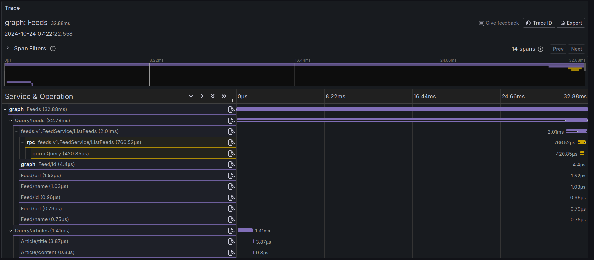
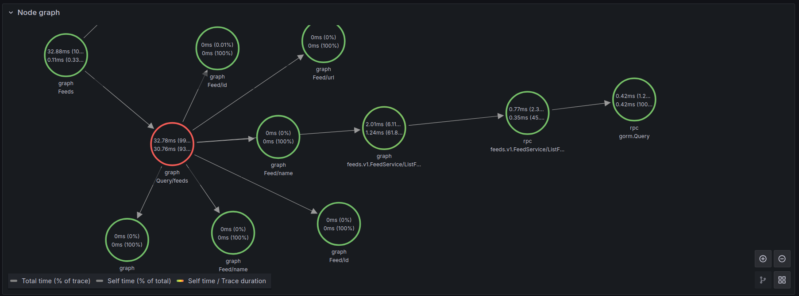
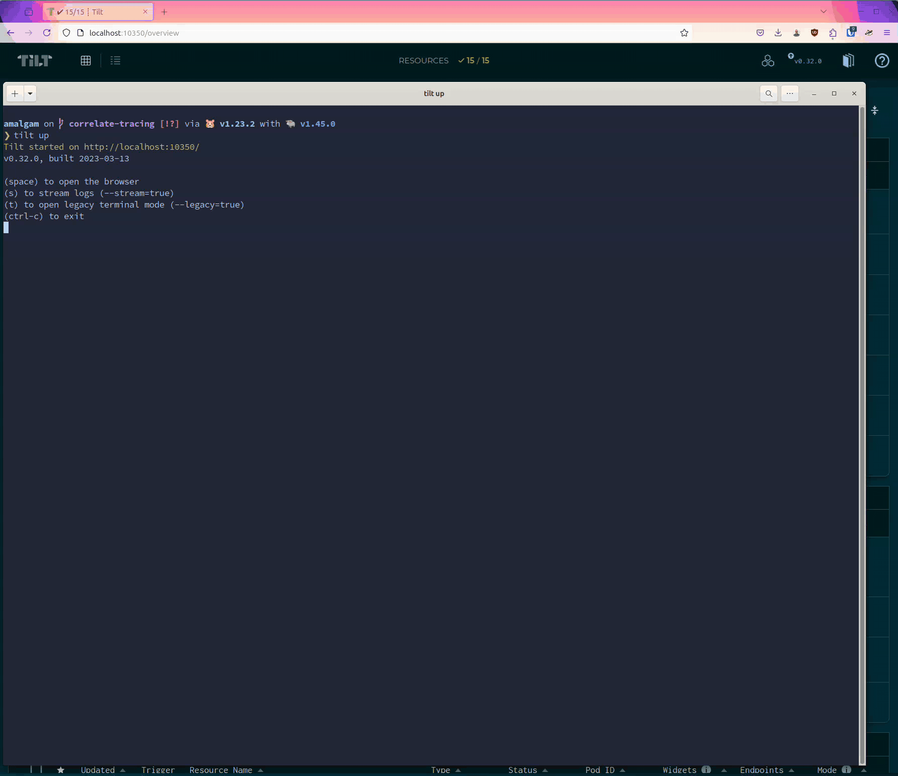

# Observability

The three pillars of observability are logs, metrics, and traces.

## Traces

Amalgam trace image:

Node graph:

### Lab: Import example trace

Note: sorry the cursor is not visible in the movie, but you can see the steps in the text below.

1. Download the [Example trace](./files/example_trace.json).
2. Start Tilt environment
3. Navigate to [Explore](http://localhost:3001/explore) (use the link from the Grafana resource in Tilt UI if this link no longer works)
4. Click on the `Import trace` button in the top right corner
5. Upload file

## Metrics

## Logs

TODO: hook up Loki and show how to query
