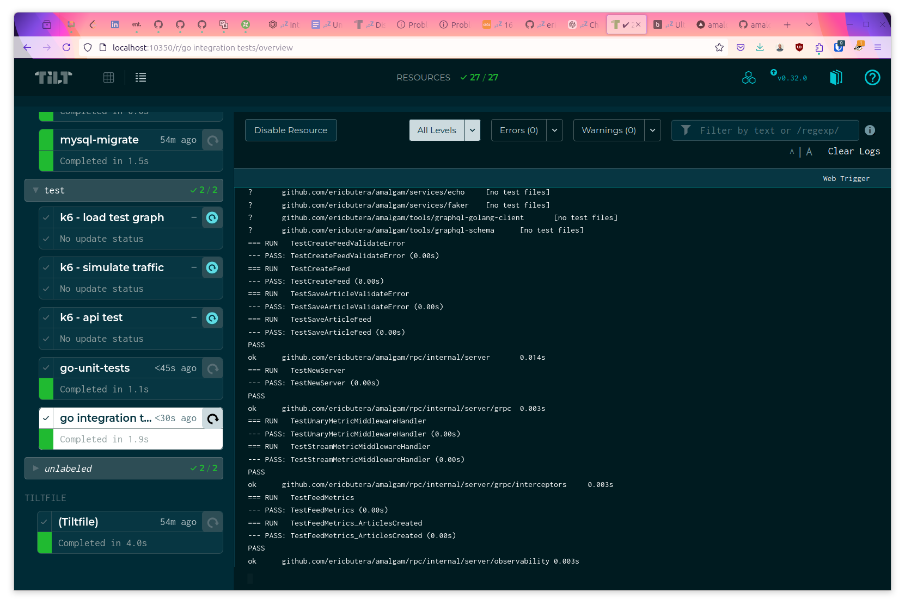
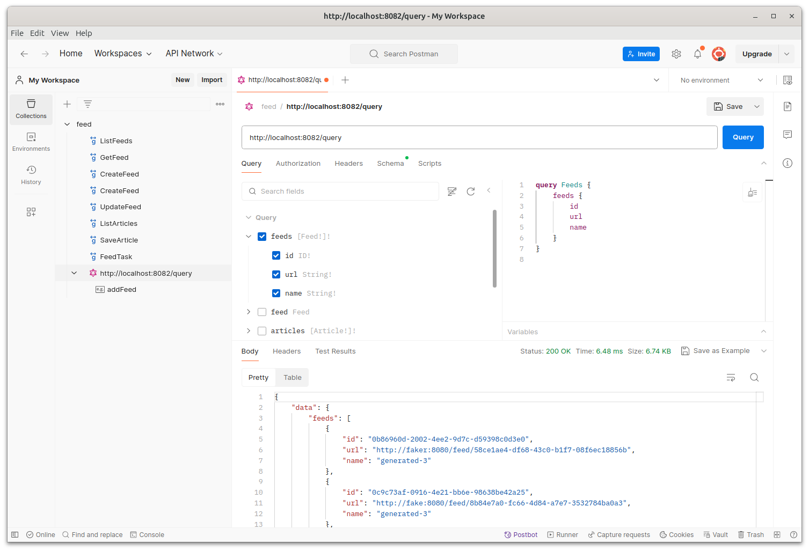
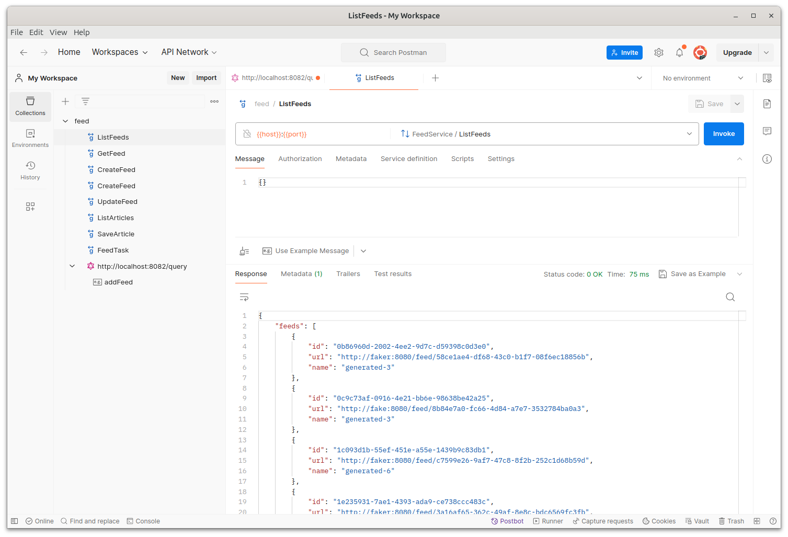

# Testing

## Precommit Hooks

Pre-commit hooks run [unit tests](https://github.com/ericbutera/amalgam/blob/ad3d79839030889826a8fb2f0c0dcad48bf9d06e/.pre-commit-config.yaml#L25-L39) to prevent committing broken code. This is optional, but will save time.

## Unit Tests

Unit tests can be ran on your dev machine using `just test` ([src](https://github.com/ericbutera/amalgam/blob/ad3d79839030889826a8fb2f0c0dcad48bf9d06e/justfile#L14)).

There is a `just go-coverage-report` ([src](https://github.com/ericbutera/amalgam/blob/ad3d79839030889826a8fb2f0c0dcad48bf9d06e/justfile#L26-L29)) command to generate a coverage report. This is useful for seeing what parts of the codebase are not covered by tests.

## Integration Tests (And End-to-End)

Golang integration tests run within Tilt ([go integration tests](http://localhost:10350/r/go%20integration%20tests/overview)). The reason for this is to prevent using things like testcontainers. Tilt is a much better orchestrator for ensuring dependencies are up and running before running tests.



Another benefit of using Tilt is `tilt ci` is able to run these tests in a CI/CD pipeline. This ensures this project is portable and can be run in any environment. These tests can also be ran using [act](https://github.com/nektos/act) via `act`.

## Data Generators

### Within Tilt environment

Navigate to Tilt > [Temporal](http://localhost:10350/r/temporal/overview) in the local environment. There should be two buttons at the top right:

- [Generate Fake Feeds](https://github.com/ericbutera/amalgam/blob/ad3d79839030889826a8fb2f0c0dcad48bf9d06e/Tiltfile#L121-L127) - creates a dozen or so feeds using [faker service](../services/faker)
- [Fetch Feeds](https://github.com/ericbutera/amalgam/blob/ad3d79839030889826a8fb2f0c0dcad48bf9d06e/Tiltfile#L115-L120) - invokes the [FetchFeeds Workflow](https://github.com/ericbutera/amalgam/blob/ad3d79839030889826a8fb2f0c0dcad48bf9d06e/data-pipeline/temporal/feed/workflow.go#L43)

Note: feeds that point to faker will continuously generate fake articles.

### RPC Feed Tasks

Generate fake feeds using a [feed task](https://github.com/ericbutera/amalgam/blob/ad3d79839030889826a8fb2f0c0dcad48bf9d06e/data-pipeline/temporal/feed_tasks/workflow.go#L9):

```sh
RPC_HOST=localhost:50055; \
grpcurl \
  -plaintext \
  -d '{"task": "TASK_GENERATE_FEEDS"}' \
  $RPC_HOST \
  feeds.v1.FeedService/FeedTask
{
  "id": "a4191c59-ea6e-407a-9116-be6726243e4c"
}
```

### K6 Testing

There are several Grafana K6 tests located in the [k6](../k6/). These tests can be run locally or within the Tilt environment.

### Postman

Postman has support for GraphQL and gRPC.



